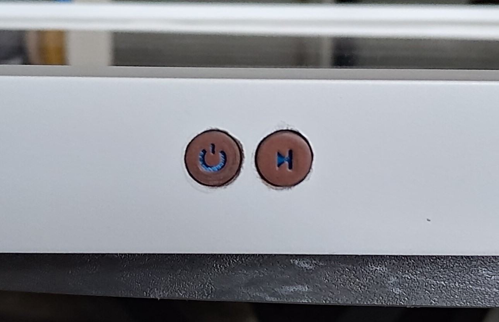
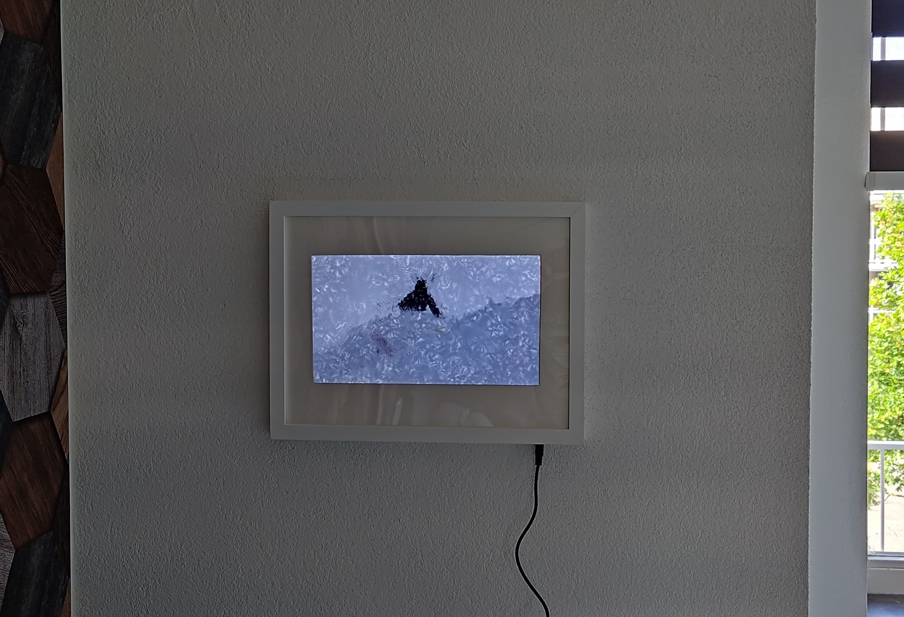

+++
title = 'Making virtual art physical - Part 2'
date = 2024-11-09T14:42:00+02:00
draft = false
keywords = ['electronics', 'code', 'open-source', 'CAD', '3D printing', 'DIY']
description = 'A blog post on how I made virtual art physical. Part 2: DIY, CAD and printing'
+++
It has been waaaay too long since I wrote [part 1]() of this series. So lets
dive into part 2!

We ended the first part with Drarwing working on the Raspberry, and the Raspberry set up the way we would like it.
However, an important part of the story is still missing: We can't see any of it. It's time to give it a physical
presence.

When I started the build, I had a general idea what I wanted it to look like. However, how to get there was still rather
unclear. So I decide to go with the iterative approach, and to focus on it step by step.

## Body building

The first step, is to simply figure out what we need. This can be done already at this stage, and we'll worry about how
to put it together when we get to it.

A quick inventory showed that we don't need all that much:

- A display panel
- Some way to connect the panel to the Pi
- A power supply for both the panel and the Pi
- Buttons to control the Pi
- A picture/painting frame to put it in

Since the frame needs to fit the other parts, we'll postpone this until we have those. That way, we can find something
that fits it all without problems.

### Imagine the image

Let's start with the display. As the whole thing needs to fit in a picture frame, a flat display is a must. Luckily, we
all have such displays around our home: laptop screens are incredibly thin. As luck would have it, my parents' laptop
had recently reached the end of it's useful lifespan and they had just replaced it. The display was still fine though.
So I extracted the display from the rest of the laptop, and disposed of the rest (naturally, I brought this to the
recycling center. Seriously, do this!). I did keep all the screws that I took out of the laptop, and was able to reuse
them later to mount all the components together.

These laptop displays don't use an HDMI cable internally, so we'll need something extra to connect the display to the
Raspberry. This is where you'll need to dive into the wild west of electronics for a bit. The display will have
it's exact model number printed on it somewhere - in my case, I found out that it was a `B140XW03 V.0` panel. Armed with
this information, it is time to hit _the Google_. You're looking for a **driver board**. I found a seller on Amazon that
sold such a board for this particular LCD panel. These driver boards are nifty parts of electronics: they'll transform
the LCD panel into a full-capability monitor. In my case, the board supports HDMI, VGA and DVI inputs, can separate the
audio from the HDMI signal into an audio jack and has a full on On-Screen menu (complete with a panel with buttons for
navigation) that allows for changing things such as brightness, color and image position and -rotation.

Of course, I don't really need most of that functionality, but for 25 euros it's not big deal that it's all included
anyway.

### POWEEEEERR!

The next step is that we need something to power it all. The display driver operates at 12V, and according to the specs
requires "3 or 5 Ampere" to power the display. Given that we'll also need power for the Raspberry Pi (adding another
0.5A or so), we'll go for a 5A, 12V PSU. The driverboard seller very helpfully also specified exactly what connector it
uses for power, so now we know exactly what PSU to order.

There's one more challenge here though - The Raspberry expects 5V instead of 12V. There's a few ways we can go about it:
we can create our own voltage divider (bad idea), we can get a second PSU or we can get an expensive converter. I did
non of these - I found a trick instead. 12V to 5V is a very common conversion; All "cigarette lighter" USB chargers
designed for cars do exactly that! These things are dirt cheap. I ordered the smallest one I could find, and stripped
the internals from the casing. The fact that it has a USB connector is an added bonus, I can just use any standard USB
cable to power the Pi.

Now we just need to split the 12 volt line from the PSU so it can go to both the display driver and the charger. I was
going to solder up my own splitter for this, or interrupt the cable somehow. But the very helpful folks at my local
electronics store (shout out to [Stevab](https://www.stevab.nl/) in Amstelveen) told me that the power draw would be too
much for a simple solder connection and had a better solution: They had a splitter for the exact connector that the PSU
and the display driver use! This has an added benefit for later: we'll be able to mount the splitter in the
frame and can then connect the PSU from outside the frame in a very clean way.

So I cut one end of the splitter and soldered it to the charger (remember, this is the Raspberry end of things, which
only sees about 0.5A, rather than the full 5A. The warning about soldering doesn't apply here). The other end just plugs
into the driverboard like before and we now have a working power setup.

### Putting it all together

It's time to think about how to bring it all together into one device. We'll need a way to hold the display, and "on the
back" of it mount all the electronics components. Since we still don't know what the frame will look like, and we need
to know how much space the final build will take up before we do, I decided to design this in a modular way:

- The _baseplate_ will hold the electronics in place
- The _display arms_ will extend from the baseplate to hold the display
- The _frame mounts_ will extend from the display arms to mount the whole thing to the frame

With this approach, I can get a feel for the first components, how it will fit together and how much space I need,
before continuing to the next part. (This modular design has nothing to do with the limitations of the how big I can
print things with my 3D printer, of course _\*cough\*_).

So it's time to hit Fusion360 and start designing parts. I started with the baseplate, and went through a few
iterations to get to the following:

We can now also design the "display arms" that attach to the baseplate and that will hold the LCD panel in place.

As you can see, we'll need to do some cable management but at this point, we have a self-contained unit that holds
(almost) all the components in place. We can't postpone it any longer - now we need to think about what the frame will
look like.

### Framing it

Finding the right frame turned out to be a lot more difficult than I expected. While I made the build as thin as I
reasonably could, the frame still had to be a bit thicker than most normal picture frames on the market. A lot of
searching later however, I found out that the deeper version of the "Rödalm" Ikea frame, after taking out the "spacer"
that sits between the glass and the passe partout, had just about enough space. The additional advantage is that these
frames are dirt cheap (like _seriously_ cheap, not sure how they can make them for this price). This way, I don't need
to worry too much about messing up the drilling and cutting that I need to do, and if I want a different style in the
future I won't be too upset about throwing out this frame.

The spacer that normally creates a sense of depth in the frame turned out to be extremely useful component of the build.
As it fits exactly inside the outline of the frame, I realized that I can mount all my electronics to this part. This
simplifies construction and lets me take the electronics out of the frame without needing to unscrew anything. That
is a huge timesaver while trying to figure out how it all fits together. I can just use the little metal fold-over tabs
that are in the frame to hold it all in place once I am happy.

So now what was left was to design the mounts between the _display arms_ and this spacer, the _frame mounts_. These
where just a simple design and print step away. Now, the electronics can be screwed into the spacer. Some further design
and printing of a bracket to hold the little board with the buttons, together with some strengthening elements to
prevent the spacer from flexing when the buttons are pressed, completed the mounting of all the components.

### The final steps

With the finish line in sight, I added a metal strip to the base plate, which I conveniently had laying around in
_exactly_ the correct size, which provides a strong mounting point for hanging the project on the wall.

One downside of using an existing photoframe, is that laptop displays are not the same dimensions as your standard photo
sizes. This meant that the passe-partout that came with the frame did not actually fit my display. It was too tall in
the vertical dimension, yet too narrow on the horizontal. So I ordered passe-partout paper, 3D-printed a knife guide to
cut the nice 45 degree bevels that passe-partouts have, and started cutting. I can proudly say I only needed 4 attempts
to get this both fitting perfect ánd looking nice without jagged edges. I'm counting that as a win.

Lastly, I wanted something to make the buttons looks special. Something that contrasts the white of the frame and that
is the cherry on top to make the build look and feel professional. What would be really cool, is to use metal for this.
Unfortunately, metal working is not (yet?) part of my skillset.

3D printing is, however! And as luck would have it, a few years ago I ordered a role of copper-infused filament. Having
decided on this approach, I started printing a few pieces, and experimenting with how to sand and polish it to make it
look somewhat like real metal. Once I was happy with the process, I printed the two buttons. In the design of the
buttons, I left a cutout that indicates the function of the button. Finally, I printed a contrasting blue part that fits
inside the button to make it standout somewhat, and as a bit of a "hidden" detail.

Unfortunately, I forgot to take any pictures of this process, but I think the end result came out pretty nice:

(better than the holes they sit in, anyway...)

And with that, the build is officially done! Now, before I show the result, I thought it would be fun to show the
recording of all the CAD that I did for this project:

## The result

Okay okay, you want to see the result, I get it. So without further ado:

All in all, I'm quite happy with how it came out. Unless you get really up close and personal with it, the finish looks
like something you could have bought in a store (maybe not a really expensive store, but I think I get away with
something mid-market, _okay?_).

Let's also have a look at some moving content:



## What's next?

As you can tell from the video above, it is rather obviously a display inside a photoframe. Unfortunately, this is a
result of the type of LCD panel used. The panel is of the so-called "TN" type. This is a somewhat older technology with
a huge glare to it and a rather bad viewing angle. For the next iteration, I would definitely want to source a newer
_IPS_ or _VA_ panel. Until then, I am considering applying an anti-glare film to the display, which would probably help
a bit.

A simpler issue that I want to tackle, is that the Ikea frame came with a plexiglas panel. This panel did not quite
stand up to my building process, and picked up quite some scratches. I will definitely replace this with a real glass
panel.

All in all though, I am happy with the results! It had been a while since I worked on a longer project, and the
combination between software and hardware in this one is something that always excites me. Now, I just need to figure
out what the next project will be...
