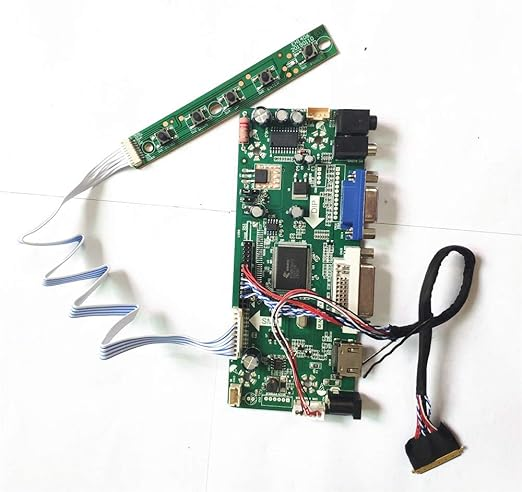
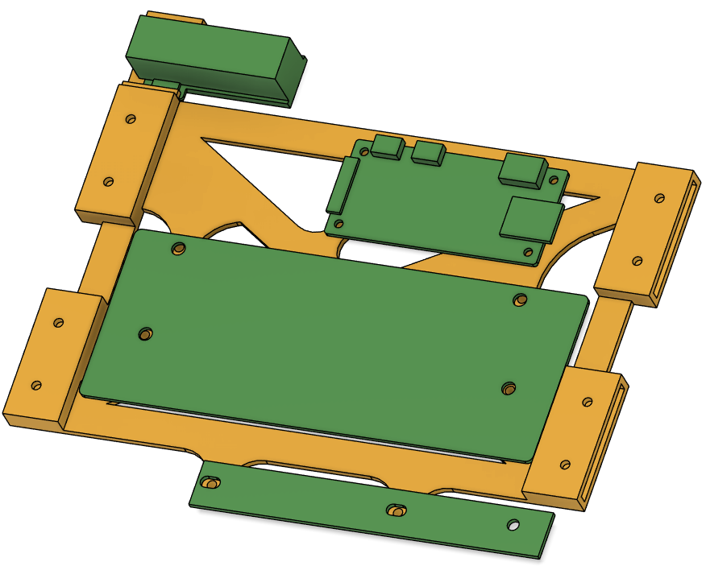
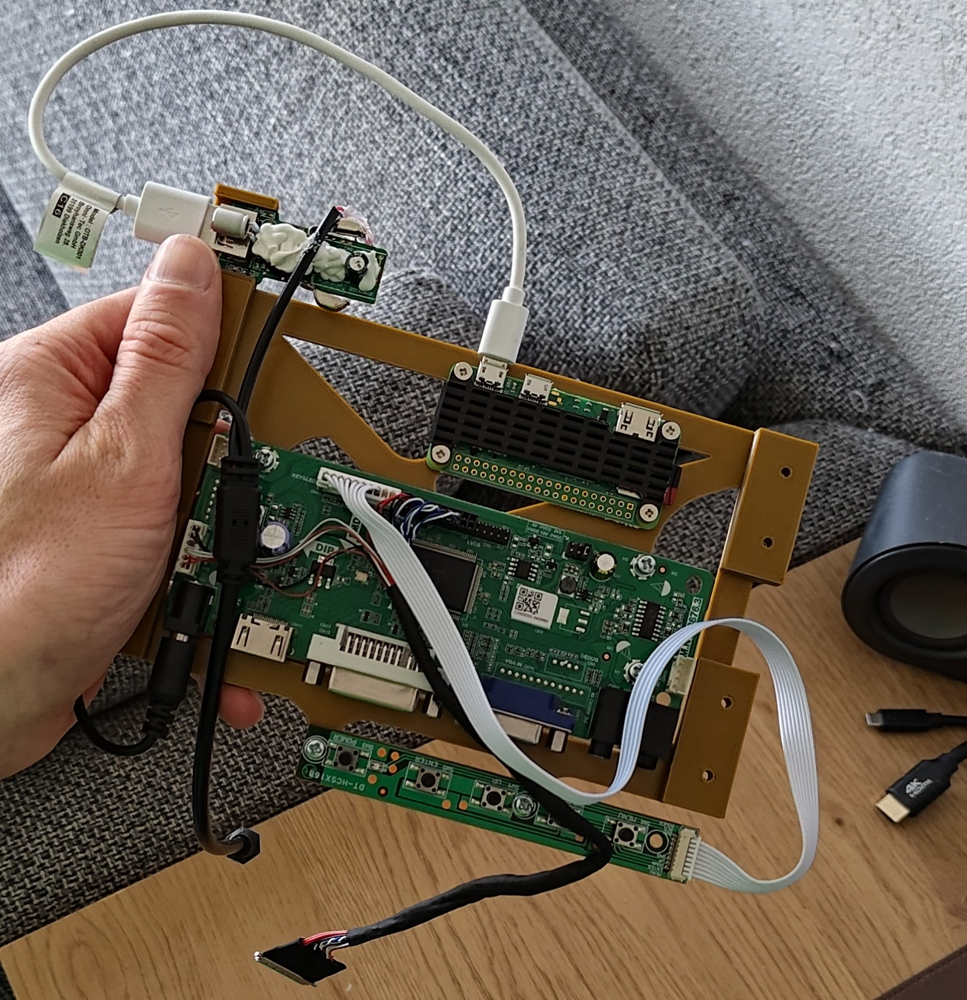
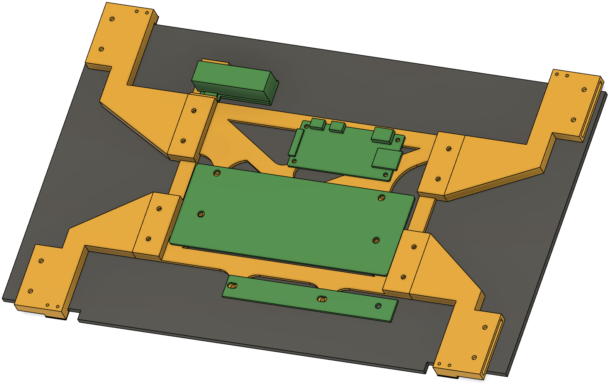
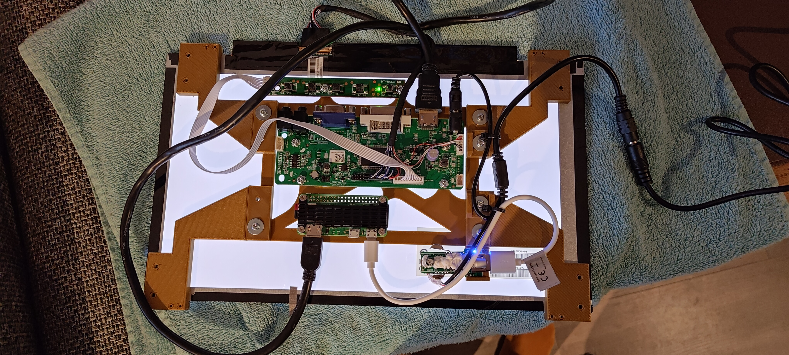

+++
title = 'Making virtual art physical - Part 2'
date = 2024-10-05T20:46:00+02:00
draft = true
keywords = ['electronics', 'code', 'open-source', 'CAD', '3D printing', 'DIY']
description = 'A blog post on how I made virtual art physical. Part 2: DIY, CAD and printing'
+++
It has been waaaay too long since I wrote [part 1]() of this series. So lets
dive into part 2 without further ado.

We ended the first part with Drarwing working on the Raspberry, and the Raspberry set up the way we would like it.
However, an important part of the story is still missing: We can't see any of it. So, it's time to give it a body.

When I started the build, I had a general idea what I wanted it to look like. However, how to get there was still rather
unclear. So I decide to go with the iterative approach, and to focus on it step by step.

## Body building!

The first step, is to simply figure out what we need. This can be done already at this stage, and we'll worry about how
to put it together when we get to it.

A quick inventory showed that we don't need all that much:

- A display panel
- Some way to connect the panel to the Pi
- A power supply for both the panel and the Pi
- Some buttons to control the Pi
- A picture/painting frame to put it in

Since the frame to put it in needs to hold the other parts, we'll postpone this until we have the parts. That
way, we can find something that fits it all without problems.

### Imagine the image

Let's start with the display. As the whole thing needs to fit in a thin picture frame while also containing all the
other electronics, a flat display is a must. Luckily, we all have such displays around our home: Laptop screens are
incredibly skinny. As luck would have it, my parents' laptop had reached the end of it's useful lifespan and they had
just replaced it. The display was still fine though. So I extracted the display from the rest of the laptop, and
disposed of the rest (_obviously_ I brought it to the recycling center's electronics dump. Seriously, do this!).

These laptop displays don't use an HDMI cable internally, so we'll need something extra to connect the display to the
Raspberry. This is where you'll need to dive into the wild west of electronics for a bit. The display will have
it's exact model number printed on it somewhere - in my case, I found out that it was a `B140XW03 V.0` panel. Armed with
this information, it is time to hit _the Google_. You're looking for a **driver board**. I found a seller on Amazon that
sold such a board for this particular LCD panel. These driver boards are nifty parts of electronics: they'll transform
the LCD panel into a full-capability monitor. In my case, the board supports HDMI, VGA and DVI inputs, can separate the
audio from the HDMI signal into an audio jack and has a full on On-Screen menu (complete with a panel with buttons for
navigation) that allows for changing things such as brightness, color and image position and -rotation.

Of course, I don't need any of that, but for 25 euros it's not big deal that it's all included anyway.

### POWEEEEERR!

The next step is that we need something to power it all. The display driver (and by extension the LCD panel) operates at
12V, and according to the specs requires "3 or 5 Ampere". Given that we'll also need to power the Pi (adding another
0.5A or so), we'll go for a 5A, 12V PSU. The driverboard seller very helpfully also specified exactly what connector it
uses for power, so now we know exactly what PSU to order.

There's one more challenge here though - The Raspberry expects 5V instead of 12V. There's a few ways we can go about it:
we can create our own voltage divider (bad idea), we can get a second PSU or we can get an expensive converter. I did
non of these - I thought of a trick instead. 12V to 5V is a very common conversion; All "cigarette lighter" USB
chargers designed for use in cars do exactly that! These things are dirt cheap. I ordered the smallest one I could find,
and stripped the internals from the casing. The fact that it has a USB connector is an added bonus, I can just use any
micro USB cable to plug into the Pi.

Now we just need to split the 12 volt line from the PSU so it can go to both the display driver and the charger. I was
going to solder up my own splitter for this, or interrupt the cable or whatever. But the very helpful folks at my local
electronics store (shout out to [Stevab](https://www.stevab.nl/) in Amstelveen) told me that the power draw would be too
much for a simple solder connection and had a better solution: They had a splitter for the exact barrel connector that
the PSU and the display driver use! This has an added benefit for later: we'll be able to mount the splitter in the
frame and can then connect the PSU from outside the frame in a very clean way.

So I cut one end of the splitter and soldered it to the charger (this is the Raspberry end of things, which has a much
smaller power draw. Hence the warning about soldering isn't an issue here). The other end just plugs into the
driverboard and we have a working power setup.

### Putting it all together

It's time to think about how to put it all together. We'll need a way to hold the display, and "on the back" of it
mount all the electronics components. Since we still don't know what the frame will look like, and we need to know how
thick the final build up will be before we do, I decided to design this in a modular way:

- The _baseplate_ will hold the electronics in place
- The _display arms_ will extend from the baseplate to hold the display
- The _frame mounts_ will extend from the display arms to mount the whole thing to the frame

(This modular design has nothing to do with the small build volume of my 3D printer of course _\*cough\*_)

So it's time to hit Fusion360 and start designing parts. I started with the baseplate, and went through a few
iterations to get to the following:

We can now also design the "display arms", that we'll bolt into the baseplate and that will hold the display in place:

As you can see, we'll need to do some cable management but at this point, we have a self-contained unit that holds
(almost) all the components in place. We can't postpone it any longer - now we need to think about what the frame will
look like.

### Framing it

## The result

## What's next?
